# Эмпирическое исследование сортировки строк

Посылки CodeForces:

- A1m / merge: `375960976`
- A1q / quick: `375962191`
- A1r / radix: `375963006`
- A1rq / qradix: `375964008`

Ссылка на публичный репозиторий: https://github.com/itzephir/set9-string-sorting

## Методика

`Benchmark` использует строки длиной от 10 до 200 символов над алфавитом из 74 символов: `A..Z`, `a..z`, `0..9` и `!@#%:;^&*()-`. Для каждого типа данных генерируется один массив из 3000 строк, после чего тестируются его префиксы размеров 100, 200, ..., 3000. Каждый алгоритм запускается 30 раз на свежей копии одних и тех же данных.

Алгоритмы:

- standard quicksort;
- standard mergesort;
- ternary string quicksort;
- LCP-aware string mergesort;
- MSD radix sort;
- MSD radix sort с переключением на string quicksort для фрагментов меньше 74 элементов.

## Среднее время работы

Следующие графики сравнивают среднее время работы в микросекундах.

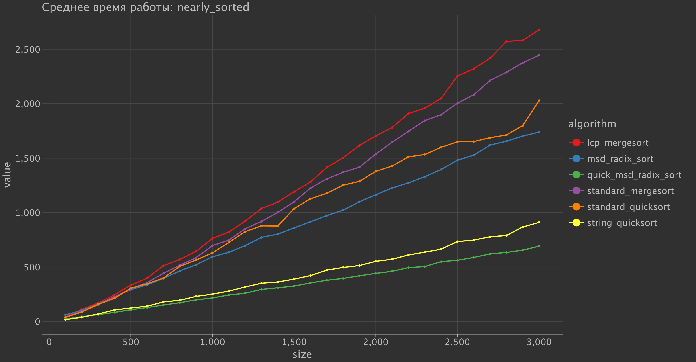
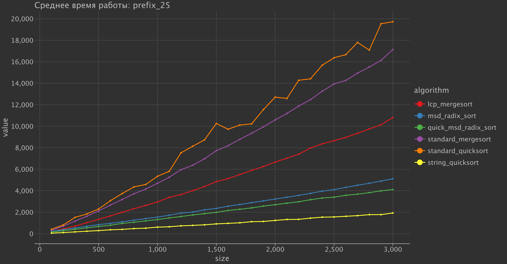
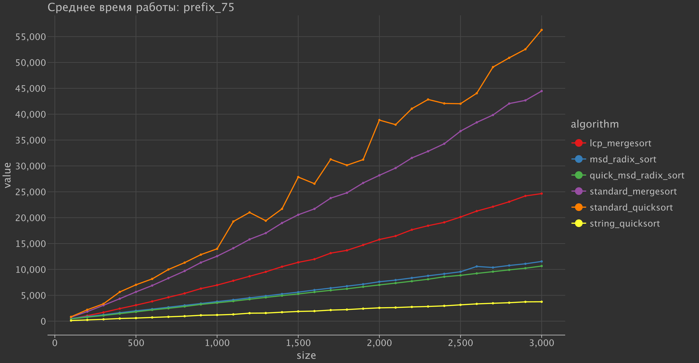
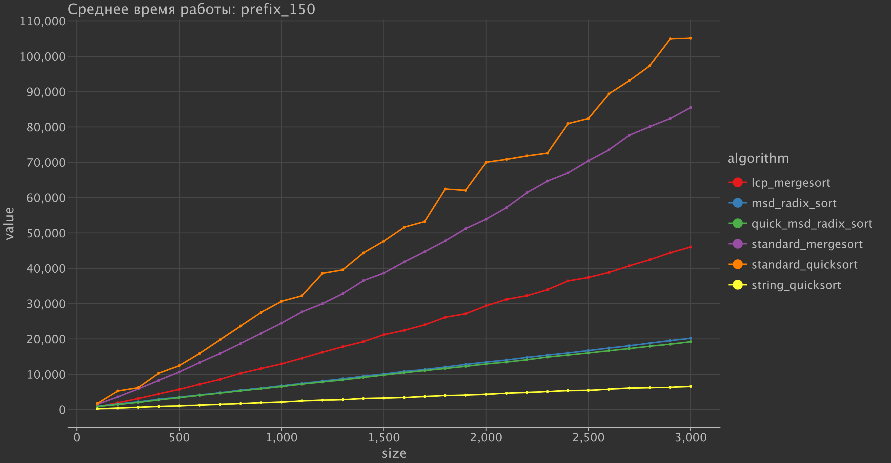
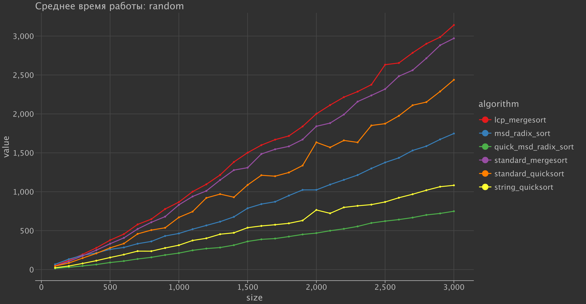
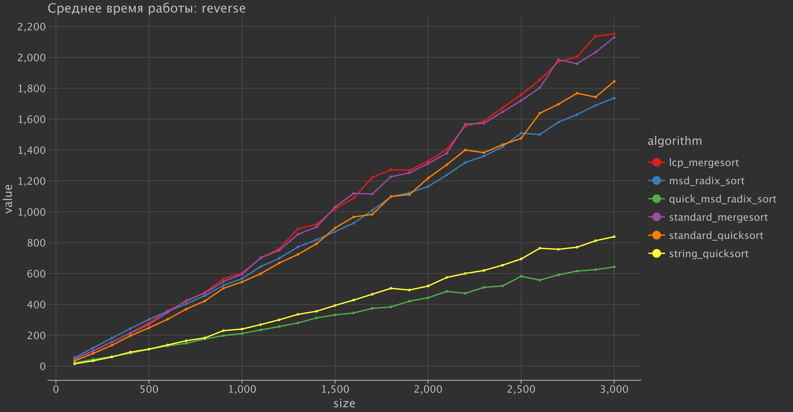

## Посимвольные сравнения и обращения

Алгоритмы на основе сравнений (`comparison-based algorithms`) учитывают прямые посимвольные сравнения. `Radix-based algorithms` не сравнивают строки тем же способом, поэтому для них учитываются обращения к символам. Общая метрика ниже удобна для отображения обеих групп алгоритмов на одном графике.

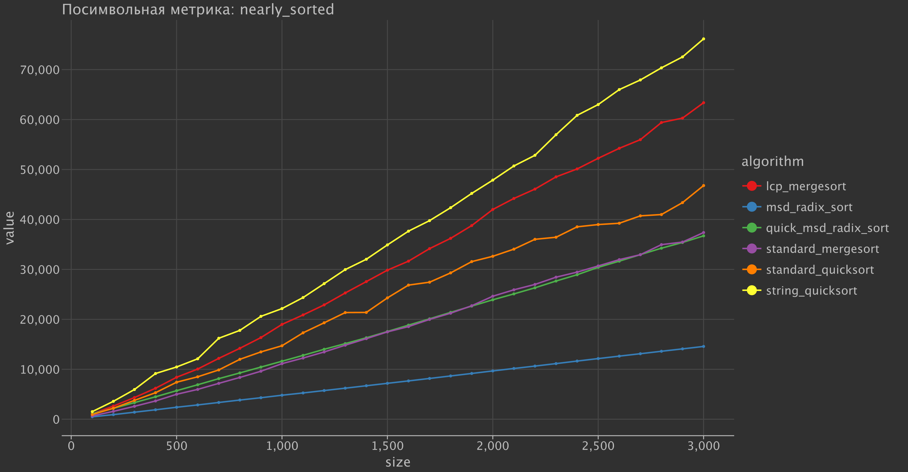
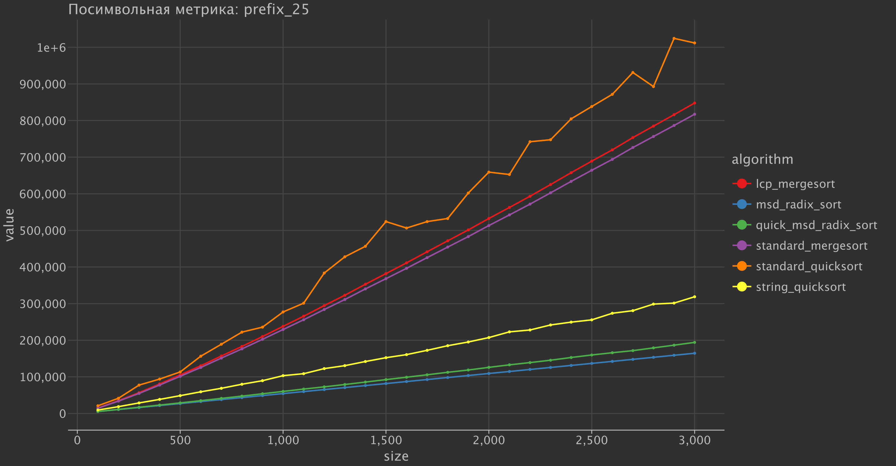
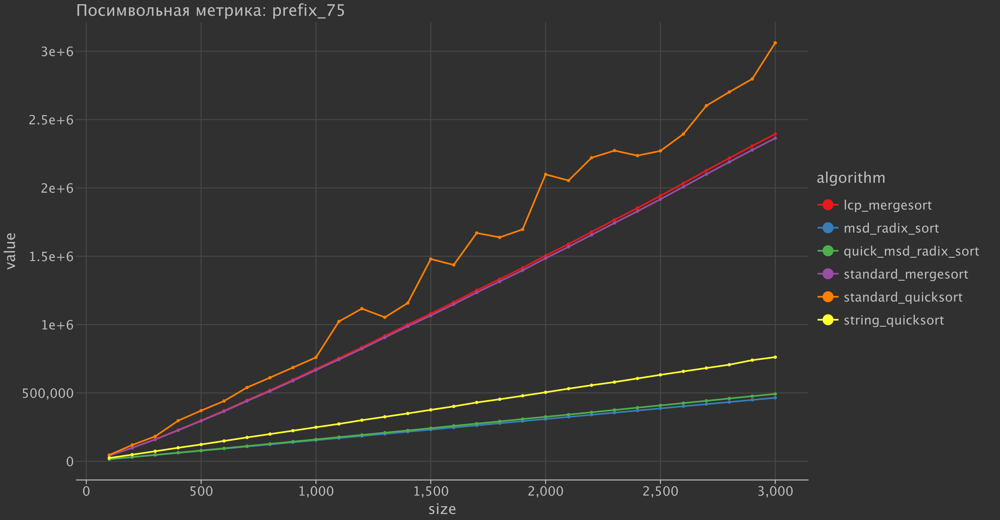
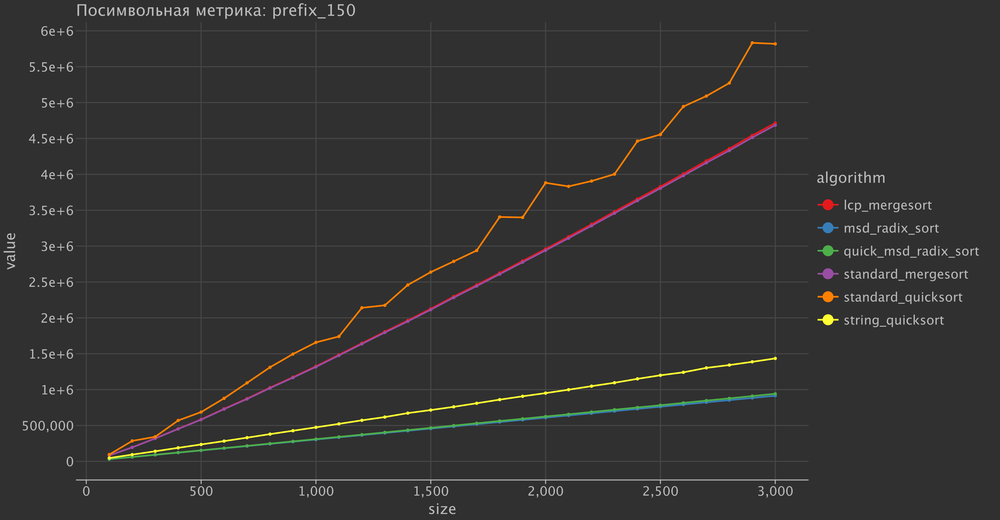
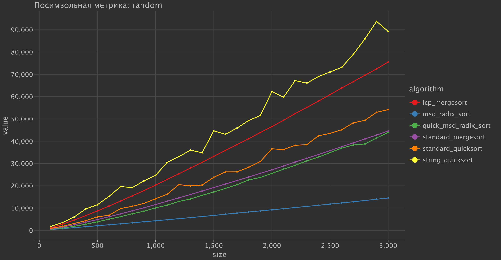
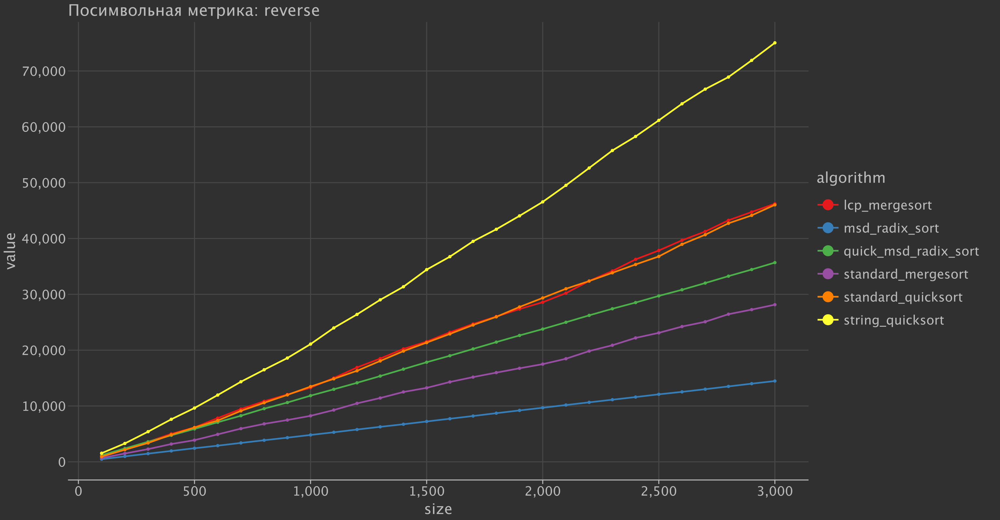

## Заметки для итогового анализа

- `Standard comparison sorts` имеют базовую оценку сложности `Omega(n log n)`, но при сортировке строк стоимость сравнения зависит еще и от длины общего префикса.
- `Ternary string quicksort` и `MSD radix sort` не сравнивают заново уже обработанные префиксы.
- На `prefix-heavy datasets` различие между обычными сортировками на основе сравнений и специализированными `string sorting algorithms` заметнее.
- Гибридный `MSD radix sort` уменьшает накладные расходы на маленьких рекурсивных фрагментах за счет переключения на `string quicksort` при размере фрагмента меньше мощности алфавита.
